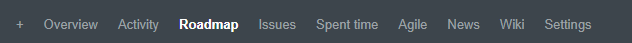
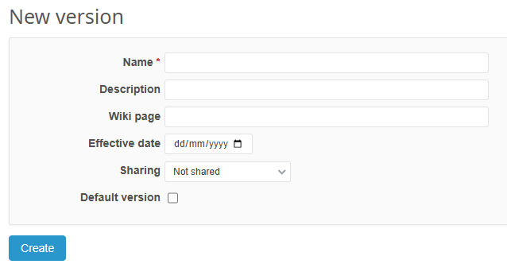
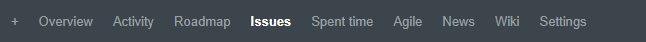
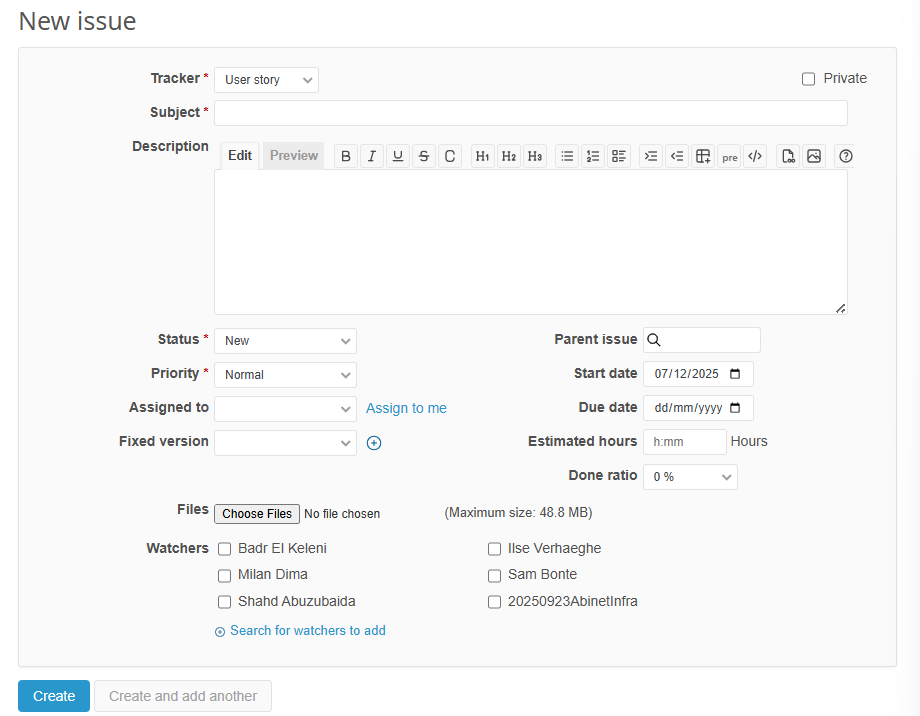
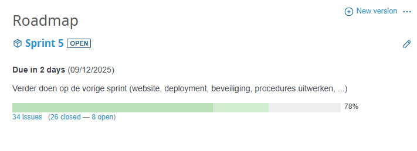
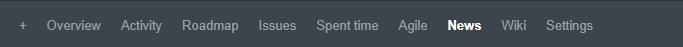
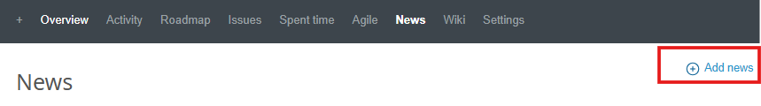
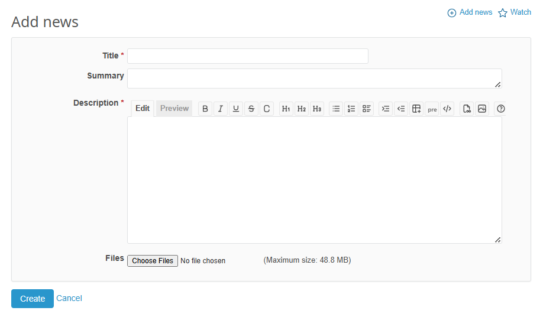
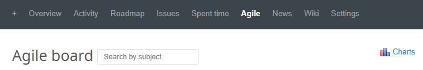
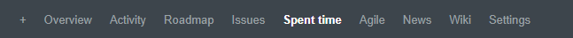

# Projectwerk Procedures Handleiding

## Inleiding
Projectwerk is een digitale projectomgeving die binnen Hogeschool VIVES wordt gebruikt voor een overzicht van praktijkgerichte opdrachten binnen Practice Enterprise te krijgen. Deze omgeving biedt studententeams een gestructureerde werkruimte om projecten in sprints op te delen, taken (tickets) toe te wijzen, en de voortgang effectief te monitoren en te beheren. Door gebruik te maken van deze omgeving kunnen teams samenwerken volgens duidelijke fasen, verantwoordelijkheden transparant verdelen en hun projectresultaten stapsgewijs realiseren.

Hieronder vind je een gedetailleerd stappenplan voor de belangrijkste procedures in Projectwerk.

---

## Een Nieuwe Sprint Aanmaken
Een sprint is een afgebakende werkperiode (meestal 1-4 weken) waarin een set vooraf gedefinieerde taken moet worden voltooid.

### Stappen:
1. Log in op het Projectwerk-platform van VIVES.
2. Selecteer je specifieke projectruimte (bijv. "Practice Enterprise [Projectnaam]").
3. Navigeer naar het tabblad **"Roadmap"**.
   
4. Klik op de knop **"New version"**.
   
5. Configureer de sprint:
   
   - **Naam:** Geef een duidelijke naam (bijv. "Sprint 1: Ontwerpfase")
   - **Description:** Optioneel - voeg een beschrijving toe
   - **Startdatum & Einddatum:** Stel de periode in
   - **Sharing:** Kies **"Not shared"**
6. Klik op **"Create"**. De sprint is nu actief en klaar om gevuld te worden met taken.

---

## Tickets (Taken) Aanmaken en aan een Sprint Koppelen
Tickets zijn de individuele taken, verbeterpunten of user stories die tijdens een sprint moeten worden uitgevoerd.

### Stappen:
1. Navigeer naar het tabblad **"Issues"**.
   
2. Klik op de knop **"New issue"**.
   
3. Vul de ticketdetails in:
   
   - **Tracker:** Kies bijvoorbeeld "User Story", "Bug", "Support" of "Assignment"
   - **Subject:** Korte, duidelijke titel
   - **Description:** Gedetailleerde uitleg, acceptatiecriteria en eventuele bijlagen
   - **Status:** New
   - **Priority:** Stel in (Low, Normal, High, Urgent, Immediate)
   - **Assigned to:** Wijs de ticket toe aan een teamlid (optioneel bij aanmaak)
   - **Fixed version:** Kies hier de sprint waaraan je werkt
   - **Start date & Due date:** Stel de data in
   - **Estimated hours:** Schatting van benodigde werktijd
   - **Done ratio:** Handmatig percentage
   - **Files:** Bijlagen toevoegen
4. Klik op **"Create"**. De ticket is nu onderdeel van de geselecteerde sprint.

---

## Projectoverzicht en Sprintvoortgang
De **Roadmap** is het strategische overzicht van je hele sprint. Het geeft je direct inzicht in welke tickets er zijn, hoe ver je bent en wat de prioriteiten zijn.

### Lezen en gebruiken van de Roadmap:
1. **Sprint Status:** De titel `Sprint 5 [OPEN]` geeft aan dat dit de actieve sprint is
2. **Deadline:** `Due in 7 days (09/12/2025)` geeft tijdsdruk en einddatum
3. **Sprintdoel:** Korte beschrijving herinnert aan hoofddoelstelling
4. **Voortgang in cijfers:**
   - `29 issues`: Totaal aantal tickets
   - `(18 closed - 11 open)`: Voltooide vs openstaande taken
   - `68%`: Algemene voortgangsindicator
5. **Actie:** Klik op de sprintnaam om naar de gedetailleerde ticketlijst te gaan

---

## News
Het tabblad **News** functioneert als het interne mededelingenbord voor je projectruimte.

### Doel:
- Belangrijke aankondigingen delen
- Teambrede communicatie over proceswijzigingen
- Informatie bewaren en terugvindbaar maken

### Stappen:
1. Navigeer naar het tabblad **"News"**.
   
2. Klik op de knop **"Add news"**.
   
3. Vul details in:
   
   - **Title:** Korte, duidelijke titel
   - **Summary:** Korte samenvatting
   - **Description:** Gedetailleerde uitleg
   - **Files:** Bijlagen toevoegen
4. Klik op **"Create"**.

---

## Het Agile Board
Het **Agile Board** is het operationele hart van je project. Dit visuele bord geeft je team een real-time overzicht van alle taken in de huidige sprint.

Het bord is opgedeeld in kolommen die de verschillende fasen van een taak weergeven.

### Wat het bord je vertelt over het team:
- **Werkverdeling:** Is het werk gelijkmatig verdeeld?
- **Voortgang:** Tickets aan de rechterkant zijn verder gevorderd
- **Klaar voor werk:** Tickets zonder toegewezen persoon zijn mogelijk nog niet opgepakt

### Hoe gebruik je het Agile Board?

#### A. Dagelijkse Werk Stroom
1. **Start je werkdag:** Open het Agile Board van je actieve sprint
2. **Pick een ticket:** Ga naar 'New', vind een ticket en sleep naar 'In Progress'
3. **Update tijdens het werk:** Upload resultaten via 'Files' of 'SharePoint'
4. **Taak afronden:** Sleep naar 'Review' of 'Resolved'

#### B. Best Practices
- **Houd het actueel:** Update de status direct
- **Wees specifiek:** Spreek als team af wat elke kolom betekent

---

## Spent Time
Het onderdeel **Spent Time** is het centrale dashboard voor het loggen, beheren en analyseren van gewerkte uren.

### A. Tijd Registreren bij een Ticket
Dit is de meest aanbevolen manier, omdat de tijd direct aan het werk wordt gekoppeld.

#### Stappen:
1. Open een specifieke ticket (Issue)
2. Zoek het vak **"Log time"**
3. Vul de gegevens in:
   - **Issue:** ID van de ticket
   - **User:** Jezelf kiezen
   - **Spent on:** Werkdatum
   - **Hours:** Aantal gewerkte uren
   - **Comment:** Concrete omschrijving
   - **Activity:** Soort activiteit (Development, Analysis, Meeting, Design)
4. Klik op **"Create"**

### B. Het "Spent Time" Overzicht Analyseren
Het hoofdscherm geeft een totaaloverzicht van alle geregistreerde uren.

#### Onderdelen:
- **Totaal Uren:** Cumulatief totaal binnen filters
- **Filterpaneel:** Maak gerichte rapportages
  - **Date:** Filter op periode
  - **User:** Bekijk uren per teamlid
  - **Issue:** Toon tijd per ticket
  - **Activity:** Filter op type werk
  - **Add filter:** Voeg extra criteria toe

#### Knoppen:
- **Apply:** Pas filters toe
- **Clear:** Wis filters
- **Save custom query:** Sla filtercombinatie op

### C. Best Practices
- **Registreer dagelijks:** Accurate dan alles op vrijdag herinneren
- **Wees specifiek:** "Bugfix login" is beter dan "gewerkt aan ticket"
- **Gebruik juiste activiteit:** Geeft inzicht in tijdverdeling
